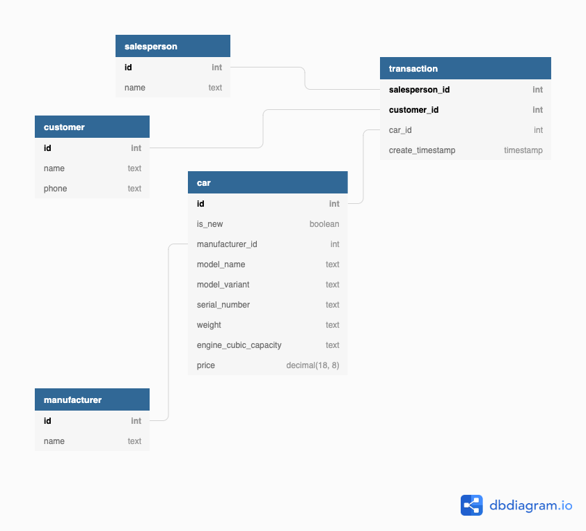
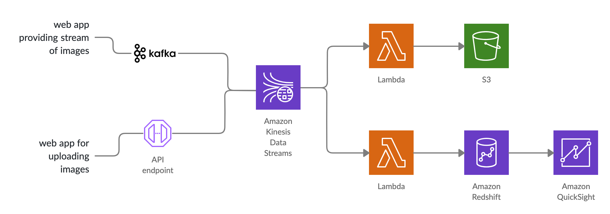

https://github.com/jaabberwocky/dataeng_test

### q1: data pipeline

to setup crontab: 

```bash
crontab -e
```

```bash
0 1 * * * /usr/bin/python /path/to/process.py >> $HOME/`date +\%Y\%m\%d\%H\%M\%S`-cron.log 2>&1
```

edit crontab as above and the script will run on 1am every day with output log file yyyyMMddHHMMSS-cron.log generated


### q2: postgres db

```bash
docker image build -t postgres_db . --no-cache
docker container run -d --name postgres_db postgres_db
docker container exec -it postgres_db psql -U admin test_db

# to show table schema
test_db-# \d car
 
```

(https://dbdiagram.io/d/5f74b9073a78976d7b75ded8)


### q3: architecture design


(https://embed.creately.com/RtRAyE9OoAP?token=IW2eAbBSMAvxnEft&type=svg)

A kinesis data stream is setup to collect data from two sources. 
- One source is from the web app where client can upload pictures. 
AWS API Gateway is setup to integrate the web app endpoint to put records to kinesis data stream. 
- Another source is the separate web app providing a stream of images using kafka stream, 
and a connector is setup to publish messages from kafka to kinesis data stream.

With the kinesis data stream ready, two consumers are setup to consume the data. 
- One Lambda consumer will apply the code to process the image on the data 
and save the processed data to a s3 bucket with a lifecycle policy set up to delete objects older than 7 days.
- Another Lambda consumer will push key statistics to Redshift which can
connect to QuickSight to build real-time dashboards.


